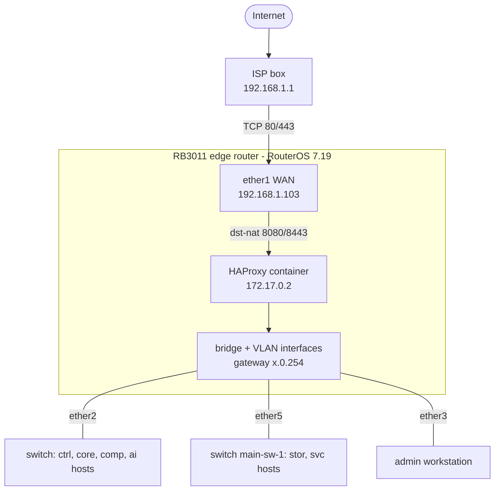
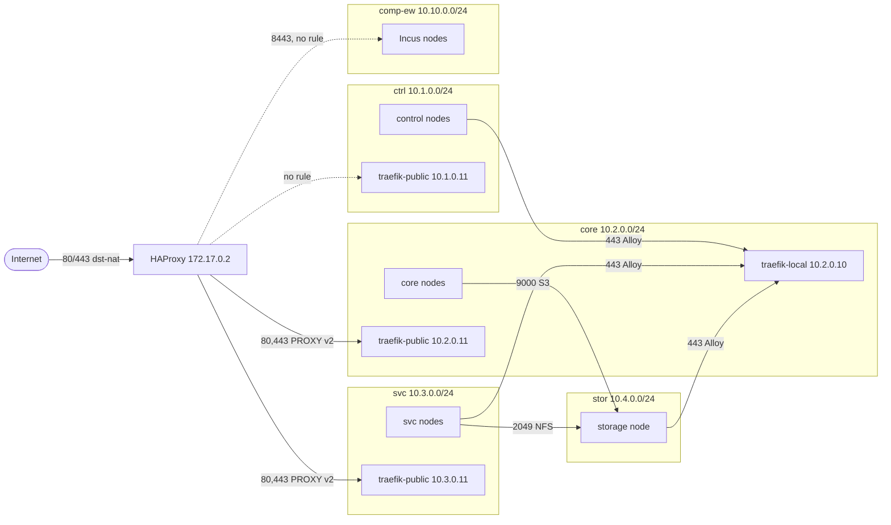

# Phorge infrastructure: architecture and network plan

How the Phorge infrastructure fits together and how this repository relates to the other two. Written from the live router (RouterOS 7.19, observed on 2026-09-20), the OpenTofu configuration, and the [FrontPlane](https://github.com/phorge-fr/Frontplane) and [Ansible](https://github.com/phorge-fr/Ansible) repositories. When a fact changes, fix it here in the same change.

- [Repositories](#repositories)
- [Topology](#topology)
- [Network plan](#network-plan)
- [Physical wiring](#physical-wiring)
- [Hosts and clusters](#hosts-and-clusters)
- [Services and public hostnames](#services-and-public-hostnames)
- [Traffic flows](#traffic-flows)
- [DNS, TLS and secrets](#dns-tls-and-secrets)
- [Roadmap](#roadmap)
- [Known inconsistencies](#known-inconsistencies)
- [Change checklists](#change-checklists)

## Repositories

| Repository | Owns | Tooling |
|---|---|---|
| **Network** (this one) | The edge router: VLANs, addressing, DHCP, DNS, firewall, NAT, and the HAProxy container that publishes services | OpenTofu, RouterOS scripts |
| **FrontPlane** | The three k0s Kubernetes clusters `control`, `core` and `svc` and everything that runs in them | FluxCD, SOPS + age, k0sctl, Cilium |
| **Ansible** | Everything that is not Kubernetes: the storage node, the HPC nodes, the Incus compute nodes, SSH hardening and the host firewalls | Ansible, Vault |

A flow between two VLANs has to be allowed in up to three places: the router (`firewall_rules` in [terraform.tfvars](../terraform.tfvars)), the host firewall (`firewall_allowed_ports` in the Ansible inventory) and, for pod traffic, a NetworkPolicy in FrontPlane. See the [checklists](#change-checklists).

## Topology

- The router is the only gateway. `ether1` is a DHCP client of the ISP box. The ISP box forwards TCP 80 and 443 to the router, which dst-NATs them to a HAProxy container running on the router itself (bridge `containers`, 172.17.0.0/24).
- The `bridge` carries the management LAN untagged (192.168.2.0/24) and the workload VLANs 20 to 80 as tagged sub-interfaces. VLAN filtering is off: every bridge port carries every VLAN, and isolation between VLANs is done by routing and the firewall on the router only.
- The VLAN interfaces use MTU 8152, so the bridge and every physical port under it need an L2MTU of at least 8156 (the bridge L2MTU is the lowest of its ports). [base_configuration.rsc](../defaults/base_configuration.rsc) sets `l2mtu=8156` and `mtu=8156` on every Ethernet port.
- The RB3011 has two switch chips (`ether1` to `ether5` on `switch1`, `ether6` to `ether10` on `switch2`). Traffic between the two groups is bridged by the CPU.

## Network plan

| Segment | VLAN | Subnet | Router address | Interface list | DHCP pool | Members |
|---|---|---|---|---|---|---|
| Management | untagged on `bridge` | 192.168.2.0/24 | 192.168.2.254 | `LAN` | 192.168.2.1-10 | admin workstation, switches (`main-sw-0` .253, `main-sw-1` .252) |
| ctrl | 20 | 10.1.0.0/24 | 10.1.0.254 | `phorge` | 10.1.0.1-253 | control cluster |
| core | 30 | 10.2.0.0/24 | 10.2.0.254 | `phorge` | 10.2.0.1-253 | core cluster |
| svc | 40 | 10.3.0.0/24 | 10.3.0.254 | `phorge` | 10.3.0.1-253 | svc cluster |
| stor | 50 | 10.4.0.0/24 | 10.4.0.254 | `phorge` | 10.4.0.1-253 | storage node |
| ai | 60 | 10.5.0.0/24 | 10.5.0.254 | `phorge` | 10.5.0.1-253 | HPC nodes |
| comp-ew | 70 | 10.10.0.0/24 | 10.10.0.254 | `phorge` | 10.10.0.1-253 | Incus compute nodes (east-west) |
| comp-ns | 80 | 10.10.1.0/24 | 10.10.1.254 | `phorge` | none | Incus north-south |
| containers | bridge | 172.17.0.0/24 | 172.17.0.1 | `Containers` | none | HAProxy (`veth1`, 172.17.0.2) |
| WAN | `ether1` | 192.168.1.0/24 | 192.168.1.103 (DHCP) | `WAN` | none | ISP box 192.168.1.1 |

Address conventions inside each cluster VLAN:

| Address | Use |
|---|---|
| `.1` to `.3` | The three nodes |
| `.4` | Kubernetes API virtual IP (Keepalived, VRRP) |
| `.10` | `traefik-local`, the internal ingress |
| `.11` | `traefik-public`, the ingress that HAProxy forwards to |
| `.13` | Forgejo SSH (svc only) |
| `.10` to `.20` | Cilium L2 load balancer pool |
| `.254` | Router |

Address lists used by the firewall: `ctrl-nodes` 10.1.0.1-3, `core-nodes` 10.2.0.1-3, `svc-nodes` 10.3.0.1-3, `stor-nodes` 10.4.0.1, `ai-nodes` 10.5.0.1-2, `comp-nodes` 10.10.0.1-3, and `container-ips` (the addresses of the veths, 172.17.0.2 today, derived from `veths`).

Firewall model:

1. **input**: only the `LAN` interface list reaches the router itself. The `phorge` VLAN interfaces also get DNS (TCP and UDP 53), and ICMP is accepted from everywhere. Containers and the WAN side get nothing else.
2. **forward**: accepted by default. Explicit drops, in order: invalid connections, new connections from `WAN` that were not dst-NATed, anything not from `LAN` towards 192.168.2.0/24 or 192.168.1.0/24, `Containers` to `phorge` (silent), everything else from `Containers` (logged as `ctr-drop`), `phorge` to `phorge`. Allowed exceptions from `terraform.tfvars` are inserted above the drops.
3. **Containers are treated as compromisable.** `containers-anti-spoof` sits above every accept and drops (logged as `ctr-spoof`) any packet that leaves the `containers` bridge with a source outside `container-ips`; the address-based accepts below it do not match an interface, so without it a container could borrow a node's address. What a container may then reach is exactly the two accepts to the core and svc ingresses on TCP 80 and 443, and each of them is also bound to `container-ips`. The masquerade rule stays: Traefik trusts PROXY headers only from the router address of its VLAN.
4. **Result**: VLAN to VLAN is denied unless listed, the management LAN reaches everything, VLANs reach the Internet, containers reach only the two ingresses, and the Internet only reaches TCP 80 and 443 through the dst-NAT rules.

## Physical wiring

Observed on 2026-09-20 from the link state and the bridge host table. Check it again after any recabling.

| Port | Chip | State | What sits behind it |
|---|---|---|---|
| `ether1` | switch1 | 1 Gbps | ISP box 192.168.1.1 (WAN) |
| `ether2` | switch1 | 1 Gbps | A switch carrying the control and core nodes, one Incus node and the GPU host |
| `ether3` | switch1 | 1 Gbps | Admin workstation |
| `ether4` | switch1 | no link | Spare |
| `ether5` | switch1 | 1 Gbps | Switch `main-sw-1` (192.168.2.252) with the storage node and the svc nodes behind it |
| `ether6` to `ether9` | switch2 | no link | Spare |
| `ether10` | switch2 | no link | Intended uplink to the managed switch. PoE-out is `auto-on` on this port only. Down on this date |
| `sfp1` | none | no link, no module | Spare |

## Hosts and clusters

| Group | Hosts | Addresses | Role | Managed by |
|---|---|---|---|---|
| control | `ctrl-rpi4-01` to `03` | 10.1.0.1-3 | k0s controller+worker | FrontPlane, Ansible (hardening, firewall) |
| core | `core-wyse-01` to `03` | 10.2.0.1-3 | k0s controller+worker | FrontPlane, Ansible |
| svc | `svc-rock64-01` to `03` | 10.3.0.1-3 | k0s controller+worker | FrontPlane, Ansible |
| storage | `stor-rpi5-01` | 10.4.0.1 | RAID 5 on 4 NVMe (`/mnt/main`), NFS export, rustfs S3 | Ansible |
| hpc-gpu | `ai-z440-01` | 10.5.0.4 (DHCP lease) | GPU node (ROCm/NVIDIA drivers, Docker) | Ansible |
| hpc-npu | `ai-rpi5-01` | 10.5.0.1 | NPU node | Ansible |
| compute | `comp-opti-01` to `03` | 10.10.0.1-3 | Incus cluster | Ansible (SSH, firewall), manual Incus setup |

All three clusters run the same stack: k0s 1.36.4, Cilium 1.19.2 as CNI with kube-proxy disabled and L2 announcements for load balancer IPs, a Keepalived virtual IP for the API, pod CIDR 10.244.0.0/16 and service CIDR 10.96.0.0/12. Flux reconciles `clusters/<name>` from FrontPlane.

| Cluster | Purpose | Workloads |
|---|---|---|
| control | Entry point: resource provisioning, AI model gateway, infrastructure frontend | cert-manager, Traefik (local + public), Alloy, Crossplane, csi-driver-nfs, kube-state-metrics |
| core | Critical internal services | cert-manager, Traefik, Alloy, Longhorn, Authentik, kube-prometheus-stack (Prometheus, Alertmanager, Grafana), Loki, OpenFGA, Uptime Kuma |
| svc | Public end-user services | cert-manager, Traefik, Alloy, csi-driver-nfs, Forgejo, kube-state-metrics |

The storage node exports `/mnt/main/csi-svc` over NFSv4 to the three svc nodes and runs rustfs (S3 on 9000, console on 9001).

## Services and public hostnames

| Hostname | Cluster | Service | Reached through |
|---|---|---|---|
| `auth.phorge.fr` | core | Authentik (OIDC SSO) | HAProxy, `traefik-public` 10.2.0.11 |
| `monitoring.phorge.fr` | core | Grafana | HAProxy, `traefik-public` 10.2.0.11 |
| `status.phorge.fr` | core | Uptime Kuma | HAProxy, `traefik-public` 10.2.0.11 |
| `git.phorge.fr` | svc | Forgejo | HAProxy, `traefik-public` 10.3.0.11 |
| `iaas.phorge.fr` | compute | Incus API and UI | HAProxy SNI routing to 10.10.0.1-3:8443 (currently blocked, see [flows](#traffic-flows)) |
| `prometheus.core.phorge`, `loki.core.phorge`, `openfga.core.phorge` | core | Prometheus, Loki, OpenFGA | `traefik-local` 10.2.0.10, internal CA, basic auth |

Forgejo also serves Git over SSH on 10.3.0.13:22, internal only.

HAProxy ([templates/haproxy.cfg.tftpl](../templates/haproxy.cfg.tftpl)) routes plain HTTP on 8080 (redirect to HTTPS for the five known hosts, everything else to the control ingress) and TLS on 8443 by SNI without terminating it: `iaas` to the Incus nodes, `auth`, `monitoring` and `status` to the core ingress, `git` to the svc ingress, anything else to the control ingress. A change to the file is picked up by the running container without a restart. The ingress addresses and the Incus node addresses are not typed in the template: they come from `networks` (`ingress` and `nodes`), and the rules that let the container reach the ingresses use the same data.

Client addresses reach the ingresses through the PROXY protocol v2. HAProxy traffic is masqueraded by the router (NAT rule for 172.17.0.0/24), so each Traefik trusts PROXY headers only from the router address of its VLAN (`x.0.254/32`, set in `overlays/*/controllers/traefik/traefik-public-patch.yml`). Changing that NAT rule, the HAProxy source or the Traefik `trustedIPs` breaks client address preservation.

## Traffic flows

Dotted arrows are flows that the architecture asks for but the firewall does not allow.

| Flow | Port | Router rule | Status |
|---|---|---|---|
| Internet to HAProxy | TCP 80, 443 to 8080, 8443 | two dst-NAT rules | allowed |
| HAProxy to core ingress 10.2.0.11 | TCP 80, 443 | `Allow Hproxy to core cluster Ingress` | allowed |
| HAProxy to svc ingress 10.3.0.11 | TCP 80, 443 | `Allow Hproxy to svc cluster Ingress` | allowed |
| HAProxy to control ingress 10.1.0.11 (default backend) | TCP 80, 443 | none | blocked by `Drop Containers to phorge` |
| HAProxy to Incus 10.10.0.1-3 (backend and health checks) | TCP 8443 | none | blocked by `Drop Containers to phorge` |
| ctrl, svc, stor nodes to core `traefik-local` (Alloy metrics and logs) | TCP 443 | three `push metrics/logs to core` rules | allowed |
| svc nodes to storage (NFS) | TCP 2049 | `NFS/TCP` rule | allowed |
| svc nodes to storage (NFS) | UDP 2049 | `NFS/UDP` rule | allowed, unused: NFSv4 uses TCP and the host firewall only opens TCP |
| core nodes to rustfs S3 (Longhorn backups) | TCP 9000 | `rustfs S3` rule | allowed; the backup target is not defined in FrontPlane yet |
| Management LAN to every VLAN | any | none needed | allowed; the host firewalls then restrict SSH, 6443, 9443, 9000, 9001 |
| Any VLAN to the router | TCP and UDP 53, ICMP | two DNS input rules | allowed |
| VLANs to the Internet | any | masquerade | allowed: image pulls, ACME, GitHub (Flux, Renovate), Cloudflare API |
| svc (Forgejo) to `auth.phorge.fr` (OIDC) | TCP 443 | none towards core | resolves through public DNS and leaves through the WAN, so it depends on NAT hairpin at the ISP box: to verify |
| Incus nodes to core `traefik-local` (Loki, OpenFGA) and BGP to the router | TCP 443, TCP 179 | none | needed when the IaaS goes live; `comp-nodes` exists but no rule uses it |
| Control cluster to the LLM gateway (LiteLLM, TCP 4000) on the HPC node | TCP 4000 | none | implied by the control cluster role and the `hpc-servers` role, which is not wired yet |

## DNS, TLS and secrets

**DNS.** The router is the resolver of every VLAN (DHCP hands out `x.0.254`). It forwards to 1.1.1.1 and to the ISP box learned by DHCP. Static records for the nodes (`*.phorge`) and the three `*.core.phorge` aliases live in `dns_records`. Public `phorge.fr` names are on Cloudflare.

**TLS.**

- Public hostnames: Let's Encrypt through cert-manager (`public-issuer`, DNS-01 with a Cloudflare token) on `traefik-public`.
- Internal hostnames: `local-root-ca`, a self-signed ECDSA CA issued by cert-manager (10 years) that signs `*.core.phorge`. Its certificate is copied to the storage node as `alloy_ca_cert`.
- The router has its own CA (`Phorge-Core-0`, RSA 2048, valid to 2036) that signs the certificate of its HTTPS service (`router-https`, with `IP:192.168.2.254`, `core0.phorge` and `main-gw-0.phorge` as subject alternative names), which is the REST API OpenTofu talks to. The provider verifies it against `certs/router-ca.pem`, a local file that is not committed.

**Secrets.** FrontPlane uses SOPS with age. Ansible uses Vault (inline `!vault` values, whole-file encryption for `.env` files). This repository keeps RouterOS credentials in `.env` (ignored) and the state in a local file (ignored) that OpenTofu encrypts with a passphrase kept in `.env`. All three GitHub repositories are public: commit ciphertext only, never plaintext.

## Roadmap

Planned work that is visible in the repositories:

- **IaaS** on the Incus cluster: OVN networking, MicroCeph storage, BGP peering with the router (the `bgp_connections` resource and the commented examples in `terraform.tfvars`), OIDC through Authentik and authorization through OpenFGA. The procedure is in `docs/incus-installation.md` of the Ansible repository.
- **HPC and AI**: the `hpc-servers` Ansible role (LiteLLM gateway, llama.cpp servers, monitoring) is not wired to a playbook yet.
- **Provisioning**: Crossplane on the control cluster.
- **Backups**: Longhorn on core backing up to rustfs on the storage node.

Each of these needs router rules that do not exist yet: see the last rows of the [flow table](#traffic-flows).

## Known inconsistencies

Things that disagree between files or between a file and the live router. None is fixed by this document.

1. DHCP pools span `.1` to `.253` of every cluster VLAN, so they overlap the nodes (`.1`-`.3`), the API virtual IP (`.4`) and the Cilium pool (`.10`-`.20`).
2. The `nfs-uncritical` StorageClass on `control` and `core` points to NFS server 10.6.0.1. No 10.6.0.0/24 network exists on the router.
3. HAProxy targets 10.1.0.11 and 10.10.0.1-3:8443 that the firewall does not allow (about 406,000 packets dropped by `Drop Containers to phorge` in the 3 days before 2026-09-20).
4. `docs/incus-installation.md` (Ansible) uses 10.1.0.x node addresses, six OVN endpoints and `*.frontplane.phorge` names. The inventory has three Incus nodes on 10.10.0.1-3, and internal names are `*.core.phorge`. The commented BGP examples in `terraform.tfvars` also use 10.1.0.1-6.
5. The GPU host is `ai-z440-01` in the inventory, holds a DHCP lease (10.5.0.4) under the hostname `hpc1`, has no DNS record, and is outside `ai-nodes` (10.5.0.1-2). The HPC monitoring config scrapes `hpc0.phorge`.
6. The FrontPlane README bootstraps Flux from a repository called `Hangar`.
7. The three clusters share the pod and service CIDRs (10.244.0.0/16, 10.96.0.0/12), which rules out a future cluster mesh or direct pod routing between them.
8. `base_configuration.rsc` disables `ether10`, the intended switch uplink.

## Change checklists

**New VLAN or cluster**

1. Network: one entry in `networks` (the VLAN, the router address, the DHCP pool and server, the `phorge` interface list membership and the `<name>-nodes` address list are derived), plus `dns_records`.
2. Ansible: inventory group, `firewall_allowed_ports` and `firewall_trusted_sources` in its `group_vars`.
3. FrontPlane: `clusters/<name>/setup/` (k0s config, `ip-pools.yml`, the interface name in `l2announcementpolicy.yml`) and the Traefik patches in `overlays/<name>/controllers/traefik/`.
4. If it is published: `ingress = 11` on its entry in `networks`, `templates/haproxy.cfg.tftpl`, then a router rule towards its ingress with `dst_ingress`.
5. Update this document.

**New flow between two VLANs**

1. Router: a rule in `firewall_rules` with a unique `id`, `before = "defconf: drop invalid"` (forward accepts) and `in_interface` set.
2. Host: `firewall_allowed_ports` (or `firewall_published_ports` for Docker) in Ansible.
3. Pods: a NetworkPolicy or CiliumNetworkPolicy in FrontPlane if the destination is a pod.
4. After applying, check that the rule counts packets: `/ip firewall filter print stats`.

**New public hostname**

1. DNS record at Cloudflare.
2. FrontPlane: an Ingress with class `traefik-public` and `cert-manager.io/cluster-issuer: public-issuer`.
3. `templates/haproxy.cfg.tftpl`: the host in the HTTP redirect ACLs and a `use_backend` line on the SNI frontend. After `tofu apply` the container reloads by itself.
4. A router rule from `containers` to that cluster's ingress, if it is a new cluster.
